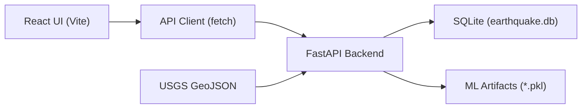
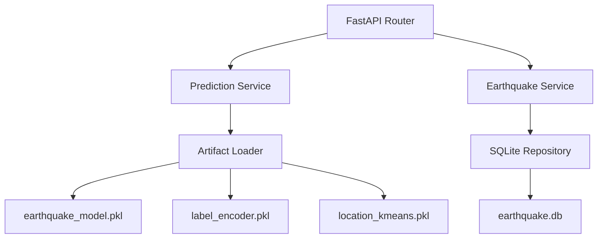

## 1. Architecture Design



## 2. Technology Description
- Frontend: React@18 + tailwindcss@3 + vite
- Initialization Tool: Vite
- Backend: Existing FastAPI (already in repo)
- Data: SQLite (earthquake.db)

## 3. Route Definitions
| Route | Purpose |
|-------|---------|
| / | Dashboard (live event, recent list, prediction form, prediction result) |

## 4. API Definitions

### 4.1 GET /earthquakes/live
- Purpose: fetch latest earthquake and refresh DB via backend logic
- Response:
```ts
type EarthquakeOut = {
  id: number | null
  magnitude: number
  depth: number
  latitude: number
  longitude: number
  location: string
  time: string
  alert_level: "SAFE" | "WARNING" | "DANGER"
}
```

### 4.2 GET /earthquakes/history
- Purpose: show recent events list
- Response:
```ts
type EarthquakeListResponse = {
  count: number
  items: EarthquakeOut[]
}
```

### 4.3 POST /earthquakes/predict
- Purpose: predict alert level for user-provided inputs
- Request:
```ts
type PredictionRequest = {
  magnitude: number
  depth: number
  latitude: number
  longitude: number
}
```
- Response:
```ts
type PredictionResponse = {
  prediction: "SAFE" | "WARNING" | "DANGER"
  confidence: number
}
```

## 5. Server Architecture Diagram



