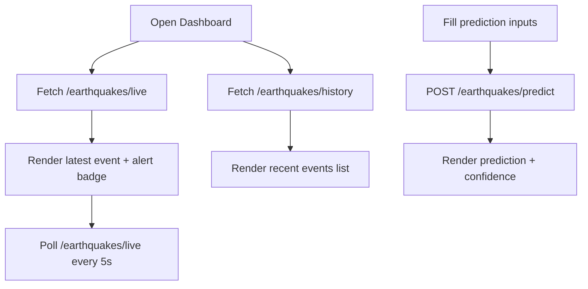

## 1. Product Overview
A React dashboard that visualizes recent earthquakes and provides an ML-based alert prediction with confidence.
It helps operators quickly assess risk levels and understand incoming events in near real time.

## 2. Core Features

### 2.1 Feature Module
1. **Dashboard**: live signal, recent events list, alert badges, prediction panel

### 2.2 Page Details
| Page Name | Module Name | Feature description |
|-----------|-------------|---------------------|
| Dashboard | Live status header | Shows API connection status, last refresh time, and latest alert level badge |
| Dashboard | Recent earthquakes list | Table/list of recent events with magnitude, location, alert level, timestamp, and quick filters |
| Dashboard | Event highlight | Prominent card for the latest event (from live endpoint) |
| Dashboard | Prediction form | Inputs for magnitude/depth/lat/lon, submit to prediction endpoint |
| Dashboard | Prediction result | Shows predicted label and confidence, with consistent color coding |
| Dashboard | Error & empty states | Clear fallback UI for API errors, empty history, and missing model artifacts |

## 3. Core Process
Main user flows:
- User opens Dashboard and immediately sees latest event and recent list.
- Dashboard polls live endpoint every 5 seconds; when a new event appears, the top card updates.
- User enters scenario values in the prediction form and receives label + confidence.

## 4. User Interface Design

### 4.1 Design Style
- Theme: dark “seismograph console” with subtle grid texture and high-contrast alert accents
- Primary colors:
  - Background: near-black graphite
  - Text: warm off-white
  - Accents: SAFE green, WARNING orange, DANGER red
- Typography:
  - Headings: a sharp display sans (Google Font)
  - Data: a mono font for coordinates/magnitude (Google Font)
- Layout:
  - Desktop-first, 12-column grid with a sticky top status bar
  - Left: live + recent list; right: prediction module
- Components:
  - Alert badge with strong color + subtle glow
  - Table rows with hover reveal and row-level severity stripe

### 4.2 Page Design Overview
| Page Name | Module Name | UI Elements |
|-----------|-------------|-------------|
| Dashboard | Live status header | Sticky bar, connection indicator, last-updated time, alert badge |
| Dashboard | Recent list | Compact table, severity stripe, sortable columns, quick filter chips |
| Dashboard | Prediction panel | Form card, validation states, submit button, result chip with confidence |

### 4.3 Responsiveness
- Desktop-first
- Mobile: stack modules vertically; prediction panel collapses into an accordion section

