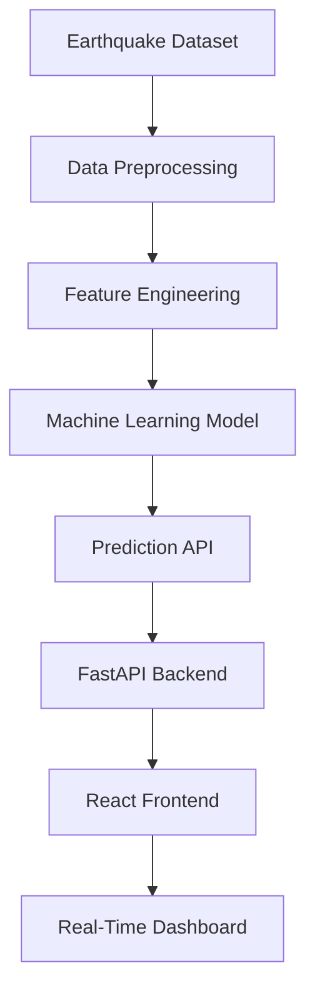

# 🌍 Earthquake Severity Forecasting Using Machine Learning

<div align="center">


### 🚨 AI-Powered Earthquake Prediction & Real-Time Alert System

Predict earthquake severity using Machine Learning, visualize seismic activity in real-time, and generate intelligent alerts through a modern full-stack web application.

</div>

---

# ✨ Features

## 🌐 Full Stack Application

* ⚡ FastAPI backend with REST APIs
* 🎨 React + TypeScript frontend
* 📊 Interactive analytics dashboard
* 🌍 Earthquake visualization map
* 📈 Real-time monitoring system

## 🤖 Machine Learning

* 📌 Earthquake severity prediction
* 🧠 Trained ML models using historical data
* 📍 Location clustering using KMeans
* 🏷️ Label encoding for categorical features
* 📉 Performance reports & confusion matrix

## 🚨 Alert System

* 🔔 Real-time earthquake alerts
* 📡 Live monitoring dashboard
* ⚠️ Risk classification system
* 📍 Region-based severity analysis

## 🐳 Deployment Ready

* 🐳 Docker support
* ☁️ Production deployment configuration
* 🔄 CI/CD ready structure
* 🔐 Environment variable support

---

# 🖼️ Project Preview

## 📊 Dashboard

```text
✔ Live Earthquake Alerts
✔ Prediction Analytics
✔ Interactive Charts
✔ Region-Based Forecasting
✔ Historical Data Visualization
```

## 🌍 System Workflow



---

# 🏗️ Tech Stack

## 🎨 Frontend

* React
* TypeScript
* Vite
* Tailwind CSS
* Chart Visualization Libraries

## ⚙️ Backend

* FastAPI
* Python
* Uvicorn
* REST APIs

## 🤖 Machine Learning

* Scikit-learn
* Pandas
* NumPy
* Joblib
* Matplotlib

## 🗄️ Data Processing

* CSV Dataset Processing
* Feature Encoding
* Clustering Algorithms

## 🚀 Deployment

* Docker
* Docker Compose
* GitHub

---

# 📂 Project Structure

```bash
Earthquake-Severity-Forecasting-Using-ML/
│
├── frontend/                     # React Frontend
│   ├── src/
│   ├── public/
│   ├── package.json
│   └── vite.config.ts
│
├── src/                          # Backend Source Code
│   └── earthquake_alert_system.py
│
├── data/                         # Dataset
│   └── EarthquakeData (2015-2024).csv
│
├── reports/                      # ML Reports & Charts
│   ├── confusion_matrix.png
│   ├── class_distribution.png
│   └── training_report.txt
│
├── earthquake_model.pkl          # Trained ML Model
├── label_encoder.pkl             # Label Encoder
├── location_kmeans.pkl           # KMeans Clustering Model
├── depth_encoder.pkl             # Depth Encoder
│
├── requirements.txt              # Python Dependencies
├── docker-compose.yml            # Docker Setup
├── DEPLOYMENT.md                 # Deployment Guide
└── README.md
```

---

# 🧠 Machine Learning Pipeline

## 📌 Data Preprocessing

* Handling missing values
* Feature encoding
* Data normalization
* Severity categorization

## 📍 Feature Engineering

* Magnitude analysis
* Depth categorization
* Geographical clustering
* Temporal analysis

## 🤖 Model Training

* Supervised Machine Learning
* Classification-based prediction
* Model evaluation using confusion matrix
* Accuracy & performance analysis

---

# 🚀 Installation & Setup

## 1️⃣ Clone Repository

```bash
git clone https://github.com/mohan-11/Earthquake-Severity-Forecasting-Using-ML.git
cd Earthquake-Severity-Forecasting-Using-ML
```

---

# ⚙️ Backend Setup

## Install Dependencies

```bash
pip install -r requirements.txt
```

## Run Backend Server

```bash
python src/earthquake_alert_system.py
```

Backend will start at:

```text
http://localhost:8000
```

---

# 🎨 Frontend Setup

## Navigate to Frontend

```bash
cd frontend
```

## Install Dependencies

```bash
npm install
```

## Run Frontend

```bash
npm run dev
```

Frontend will start at:

```text
http://localhost:5173
```

---

# 🐳 Docker Setup

## Run Using Docker

```bash
docker-compose up --build
```

---

# 📡 API Endpoints

| Method | Endpoint       | Description                 |
| ------ | -------------- | --------------------------- |
| GET    | `/`            | API Status                  |
| POST   | `/predict`     | Predict earthquake severity |
| GET    | `/earthquakes` | Fetch earthquake data       |
| GET    | `/alerts`      | Get active alerts           |
| GET    | `/analytics`   | Analytics & statistics      |

---

# 📊 Model Reports

## Included Reports

* ✅ Confusion Matrix
* ✅ Class Distribution
* ✅ Training Accuracy Report
* ✅ Prediction Analysis

---

# 🌍 Future Enhancements

* 🌐 Live earthquake API integration
* 📱 Mobile application
* 🔔 SMS & Email alerts
* ☁️ Cloud deployment
* 🧠 Deep Learning integration
* 📈 Real-time streaming analytics

---

# 👨‍💻 Author

## Mohan Kadambande

### 🚀 AI | Machine Learning | Full Stack Developer

* 🌐 GitHub: [https://github.com/mohan-11](https://github.com/mohan-11)
* 💼 Passionate about AI-powered real-world systems
* ⚡ Building intelligent applications using ML & modern web technologies

---

# ⭐ Support

If you found this project useful:

⭐ Star the repository
🍴 Fork the project
🛠️ Contribute improvements

---

# 📜 License

This project is licensed under the MIT License.

---

<div align="center">

## 🌍 “Predicting Earthquakes with the Power of AI” ⚡

Made with ❤️ using Machine Learning, FastAPI, and React.

</div>
